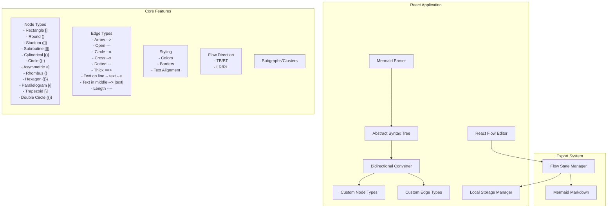

# Mermaid-Compatible Flowchart Editor Implementation Plan

## Architecture Overview



## 1. Docker Environment Setup (1-2 days)

### Development Environment
```dockerfile
# Development Dockerfile (Dockerfile.dev)
FROM node:20-alpine
WORKDIR /app
COPY package*.json ./
RUN npm install
COPY . .
EXPOSE 5173
CMD ["npm", "run", "dev"]
```

### Production Environment
```dockerfile
# Production Dockerfile
FROM node:20-alpine as builder
WORKDIR /app
COPY package*.json ./
RUN npm install
COPY . .
RUN npm run build

FROM nginx:alpine
COPY --from=builder /app/dist /usr/share/nginx/html
COPY nginx.conf /etc/nginx/conf.d/default.conf
EXPOSE 80
CMD ["nginx", "-g", "daemon off;"]
```

### Docker Compose
```yaml
version: '3.8'
services:
  web:
    build:
      context: .
      dockerfile: Dockerfile.dev
    ports:
      - "5173:5173"
    environment:
      - NODE_ENV=development
```

## 2. Test Infrastructure (2-3 days)

### Test Environment Setup
- Configure Vitest for unit testing
- Setup React Testing Library
- Configure Cypress for E2E testing
- Setup test coverage reporting

### Core Test Suites

#### AST Tests
```typescript
describe('FlowchartAST', () => {
  describe('Parser', () => {
    test('parses basic flowchart syntax', () => {});
    test('handles node declarations', () => {});
    test('processes edge definitions', () => {});
    test('parses subgraphs', () => {});
    test('maintains direction information', () => {});
  });

  describe('Validation', () => {
    test('validates node references', () => {});
    test('checks edge connections', () => {});
    test('verifies subgraph structure', () => {});
  });

  describe('Transformation', () => {
    test('converts to react-flow format', () => {});
    test('converts from react-flow format', () => {});
    test('preserves all properties', () => {});
  });
});
```

#### Node Shape Tests
```typescript
describe('MermaidNodeShapes', () => {
  describe('AST Generation', () => {
    test('generates AST for rectangle []', () => {});
    test('generates AST for round ()', () => {});
    test('generates AST for stadium ([)]', () => {});
    test('generates AST for subroutine [[]]', () => {});
    test('generates AST for cylindrical [()]', () => {});
    test('generates AST for circle ((-))', () => {});
    test('generates AST for asymmetric >]', () => {});
    test('generates AST for rhombus {}', () => {});
    test('generates AST for hexagon {{}}', () => {});
    test('generates AST for parallelogram [/]', () => {});
    test('generates AST for trapezoid [\\]', () => {});
    test('generates AST for double circle (())', () => {});
  });

  describe('React Flow Conversion', () => {
    test('converts AST to rectangle node', () => {});
    test('converts AST to round node', () => {});
    // ... tests for each node type
  });

  describe('Rendering', () => {
    test('renders rectangle node []', () => {});
    test('renders round edges node ()', () => {});
    test('renders stadium shaped node ([)]', () => {});
    test('renders subroutine shape [[]]', () => {});
    test('renders cylindrical node [()]', () => {});
    test('renders circle node ((-))', () => {});
    test('renders asymmetric shape >]', () => {});
    test('renders rhombus node {}', () => {});
    test('renders hexagon node {{}}', () => {});
    test('renders parallelogram [/]', () => {});
    test('renders trapezoid [\\]', () => {});
    test('renders double circle node (())', () => {});
  });
});
```

#### Edge Tests
```typescript
describe('MermaidEdgeTypes', () => {
  describe('AST Generation', () => {
    test('generates AST for arrow -->', () => {});
    test('generates AST for open line ---', () => {});
    test('generates AST for circle --o', () => {});
    test('generates AST for cross --x', () => {});
    test('generates AST for dotted -.->', () => {});
    test('generates AST for thick ==>', () => {});
    test('generates AST for text on line', () => {});
    test('generates AST for middle text', () => {});
  });

  describe('React Flow Conversion', () => {
    test('converts AST to arrow edge', () => {});
    test('converts AST to styled edges', () => {});
    // ... tests for each edge type
  });

  describe('Rendering', () => {
    test('renders default arrow -->', () => {});
    test('renders open line ---', () => {});
    test('renders circle end --o', () => {});
    test('renders cross end --x', () => {});
    test('renders dotted line -.->', () => {});
    test('renders thick line ==>', () => {});
    test('renders text on line -- text -->', () => {});
    test('renders text in middle --> |text|', () => {});
    test('renders text with no arrow -- text --', () => {});
    test('renders different line lengths', () => {});
    test('combines different styles with text', () => {});
  });
});
```

#### Local Storage Tests
```typescript
describe('LocalStorageManager', () => {
  beforeEach(() => {
    localStorage.clear();
  });

  describe('AST Storage', () => {
    test('serializes AST to storage', () => {});
    test('deserializes AST from storage', () => {});
    test('handles invalid AST data', () => {});
  });

  describe('saveFlowState', () => {
    test('saves current flow state', () => {});
    test('handles large diagrams', () => {});
    test('updates existing state', () => {});
  });
  
  describe('loadFlowState', () => {
    test('loads saved flow state', () => {});
    test('handles missing state', () => {});
    test('maintains node positions', () => {});
  });

  describe('autoSave', () => {
    test('automatically saves changes', () => {});
    test('debounces frequent updates', () => {});
  });
});
```

#### Converter Tests
```typescript
describe('MermaidConverter', () => {
  describe('Mermaid to AST', () => {
    test('parses flowchart syntax to AST', () => {});
    test('handles all node types', () => {});
    test('processes edge definitions', () => {});
    test('maintains subgraph structure', () => {});
  });

  describe('AST to React Flow', () => {
    test('converts AST to nodes and edges', () => {});
    test('preserves node properties', () => {});
    test('maintains edge connections', () => {});
    test('handles subgraphs', () => {});
  });

  describe('React Flow to AST', () => {
    test('converts elements to AST', () => {});
    test('preserves all styles', () => {});
    test('maintains relationships', () => {});
  });

  describe('AST to Mermaid', () => {
    test('generates valid syntax', () => {});
    test('includes all elements', () => {});
    test('formats correctly', () => {});
  });
});
```

## 3. Core Implementation (2-3 weeks)

### Phase 1: AST Foundation (Week 1)

<details>
  <summary><b>AST Implementation Guide</b></summary>


### What is an AST?
An Abstract Syntax Tree (AST) is a tree representation of the syntactic structure of source code or, in our case, Mermaid markdown. Think of it as a structured JSON object that represents every element of a flowchart in a way that's easy to manipulate programmatically.

### Why Use an AST?
1. **Separation of Concerns**
   - Parser: Mermaid syntax → AST
   - Transformer: AST → React Flow elements
   - Generator: AST → Mermaid syntax
   This makes each part easier to test and maintain.

2. **Validation**
   - AST makes it easier to validate the structure
   - Can catch errors before converting to React Flow
   - Ensures generated Mermaid syntax will be valid

3. **Bidirectional Conversion**
   - AST acts as an intermediate format
   - Makes it easier to convert in both directions
   - Maintains all properties and relationships

### Implementation Steps

1. **Start with the Parser**
```typescript
// Example of parsing a simple node
function parseNode(line: string): NodeAST {
  // Input: "A[This is a box]"
  const nodeRegex = /^([A-Za-z0-9_]+)(\[.*\]|\(.*\)|{.*}|>.*\])/;
  const match = line.match(nodeRegex);
  
  if (!match) throw new Error('Invalid node syntax');
  
  const [_, id, shape] = match;
  const text = shape.slice(1, -1); // Remove brackets
  
  return {
    id,
    type: determineNodeType(shape), // Based on brackets/shape
    text,
    position: undefined // Will be set by React Flow
  };
}

// Example of determining node type
function determineNodeType(shape: string): NodeType {
  const firstChar = shape[0];
  const lastChar = shape[shape.length - 1];
  
  switch (true) {
    case firstChar === '[' && lastChar === ']': return 'rectangle';
    case firstChar === '(' && lastChar === ')': return 'round';
    case firstChar === '{' && lastChar === '}': return 'rhombus';
    // ... other cases
  }
}
```

2. **Build the AST Transformer**
```typescript
// Example of converting AST to React Flow
function astToReactFlow(ast: FlowchartAST): ReactFlowElements {
  const nodes = ast.nodes.map(node => ({
    id: node.id,
    type: nodeTypeToReactFlow(node.type),
    data: { label: node.text },
    position: node.position || { x: 0, y: 0 },
    style: node.style
  }));

  const edges = ast.edges.map(edge => ({
    id: `${edge.from}-${edge.to}`,
    source: edge.from,
    target: edge.to,
    type: edgeTypeToReactFlow(edge.type),
    label: edge.text,
    style: edge.style
  }));

  return { nodes, edges };
}
```

3. **Implement the Generator**
```typescript
// Example of generating Mermaid syntax
function generateMermaid(ast: FlowchartAST): string {
  const lines: string[] = [
    `flowchart ${ast.direction}`,
    '',
    // Generate node declarations
    ...ast.nodes.map(node => 
      `    ${node.id}${nodeTypeToMermaid(node.type)}${node.text}${
        node.style ? ` style ${node.id} ${styleToMermaid(node.style)}` : ''
      }`
    ),
    '',
    // Generate edge connections
    ...ast.edges.map(edge =>
      `    ${edge.from}${edgeTypeToMermaid(edge.type)}${
        edge.text ? `|${edge.text}|` : ''
      }${edge.to}`
    )
  ];

  return lines.join('\n');
}
```

### Common Pitfalls and Solutions

1. **Parsing Edge Cases**
```typescript
// Problem: Complex node text might contain brackets
const line = 'A[Text with [nested] brackets]';

// Solution: Use more sophisticated regex or parser
function parseNodeWithNestedBrackets(line: string): NodeAST {
  let bracketCount = 0;
  let id = '';
  let content = '';
  
  for (let i = 0; i < line.length; i++) {
    const char = line[i];
    if (char === '[') bracketCount++;
    if (char === ']') bracketCount--;
    
    if (bracketCount === 0 && !id) {
      id = line.slice(0, i);
    } else if (bracketCount > 0) {
      content += char;
    }
  }
  
  return { id, type: 'rectangle', text: content };
}
```

2. **Maintaining State**
```typescript
// Problem: Need to track node positions between conversions

// Solution: Store positions in AST
interface NodeAST {
  id: string;
  type: NodeType;
  text: string;
  position?: { x: number; y: number };
}

// When converting from React Flow to AST
function reactFlowToAST(elements: ReactFlowElements): FlowchartAST {
  return {
    type: 'flowchart',
    direction: determineDirection(elements),
    nodes: elements.nodes.map(node => ({
      id: node.id,
      type: reactFlowToNodeType(node.type),
      text: node.data.label,
      position: { x: node.position.x, y: node.position.y }
    }))
    // ... edges
  };
}
```

3. **Edge Text Placement**
```typescript
// Problem: Mermaid has multiple ways to specify edge text

// Solution: Normalize in AST, then convert based on context
interface EdgeAST {
  from: string;
  to: string;
  type: EdgeType;
  text?: string;
  textPlacement?: 'middle' | 'along' | 'none';
}

function edgeToMermaid(edge: EdgeAST): string {
  const connection = edge.type === 'default' ? '-->' : 
                    edge.type === 'dotted' ? '-.->' : '==>';
                    
  if (!edge.text) return `${edge.from}${connection}${edge.to}`;
  
  return edge.textPlacement === 'middle' 
    ? `${edge.from}${connection}|${edge.text}|${edge.to}`
    : `${edge.from}-- ${edge.text} -->${edge.to}`;
}
```

### Testing Strategy

1. **Unit Test Each Component**
```typescript
describe('Parser', () => {
  test('handles nested brackets', () => {
    const input = 'A[Text with [nested] brackets]';
    const ast = parseNode(input);
    expect(ast).toEqual({
      id: 'A',
      type: 'rectangle',
      text: 'Text with [nested] brackets'
    });
  });
});
```

2. **Integration Test Conversions**
```typescript
describe('Bidirectional Conversion', () => {
  test('maintains all properties through conversion cycle', () => {
    const original = `
      flowchart TB
        A[Hello] --> B{World}
        B --> C([!])
    `;
    
    const ast = parseToAST(original);
    const reactFlow = astToReactFlow(ast);
    const newAst = reactFlowToAST(reactFlow);
    const generated = astToMermaid(newAst);
    
    // Should match semantically (ignoring whitespace/formatting)
    expect(normalize(generated)).toEqual(normalize(original));
  });
});
```

### Tips for Implementation

1. **Start Small**
   - Begin with basic rectangle nodes and simple arrows
   - Add more complex shapes and edge types incrementally
   - Test each addition thoroughly

2. **Use TypeScript**
   - Define clear interfaces for each AST component
   - Let the type system help catch errors
   - Document expected formats and restrictions

3. **Debugging**
   - Add a development-only AST viewer component
   - Log AST state at each conversion step
   - Use visual diffing for Mermaid output

4. **Performance**
   - Parse and generate on demand, not continuously
   - Cache AST for undo/redo operations
   - Batch React Flow updates

Remember: The AST is just a structured way to represent your flowchart. Think of it as the "source of truth" that both Mermaid and React Flow will read from and write to. This separation makes it easier to handle the complexity of bidirectional conversion.
</details>

1. Implement AST Data Structures
```typescript
interface FlowchartAST {
  type: 'flowchart';
  direction: 'TB' | 'BT' | 'LR' | 'RL';
  nodes: NodeAST[];
  edges: EdgeAST[];
  subgraphs?: SubgraphAST[];
}

interface NodeAST {
  id: string;
  type: NodeType;
  text: string;
  style?: NodeStyle;
  position?: Position;
}

interface EdgeAST {
  from: string;
  to: string;
  type: EdgeType;
  text?: string;
  style?: EdgeStyle;
}

interface SubgraphAST {
  id: string;
  nodes: string[];
  title?: string;
}
```

2. Implement Parser
```typescript
class MermaidParser {
  parse(markdown: string): FlowchartAST;
  parseNode(syntax: string): NodeAST;
  parseEdge(syntax: string): EdgeAST;
  parseSubgraph(syntax: string): SubgraphAST;
}
```

3. Implement AST Converter
```typescript
class ASTConverter {
  toReactFlow(ast: FlowchartAST): ReactFlowElements;
  fromReactFlow(elements: ReactFlowElements): FlowchartAST;
}
```

4. Implement Local Storage with AST Support
```typescript
class LocalStorageManager {
  saveAST(ast: FlowchartAST): void;
  loadAST(): FlowchartAST | null;
  autoSave(ast: FlowchartAST): void;
}
```

### Phase 2: Node Types (Week 1-2)
1. Basic Shapes (with AST support)
   - Rectangle node []
   - Round edges node ()
   - Stadium shaped node ([])
   - Subroutine shape [[]]

2. Special Shapes (with AST support)
   - Cylindrical node [()] 
   - Circle node ((-)
   - Asymmetric shape >]

3. Geometric Shapes (with AST support)
   - Rhombus node {}
   - Hexagon node {{}}
   - Parallelogram [/]
   - Trapezoid [\]
   - Double circle node (())

### Phase 3: Edge Types (Week 2)
1. Arrow Types (with AST support)
   - Default arrow -->
   - Open line ---
   - Circle end --o
   - Cross end --x
   - Dotted line -.-
   - Thick line ==>

2. Edge Features (with AST support)
   - Text placement options
   - Line length variations
   - Style combinations

### Phase 4: Advanced Features (Week 3)
1. Subgraphs (with AST support)
2. Custom styling (with AST support)
3. Direction control (with AST support)

## 4. UI Implementation (1 week)

### Components
- Node shape selector toolbar
- Edge style selector
- Property panel
- Export dialog
- Preview panel
- Auto-save indicator
- AST Debug View (development only)

### Features
- Drag and drop
- Keyboard shortcuts
- Responsive design
- Accessibility
- State persistence with AST
- Real-time AST updates

## 5. Production Readiness (1 week)

### Performance
- AST parsing optimization
- Code splitting
- Asset optimization
- Caching strategy
- Load testing
- Local storage optimization

### Security
- AST validation
- Input sanitization
- XSS prevention
- CSRF protection
- Security headers
- Local storage sanitization

### Monitoring
- AST parsing errors
- Error tracking
- Performance monitoring
- Usage analytics
- Health checks

## Development Commands

```bash
# Development
docker-compose up

# Run tests
docker-compose exec web npm test

# Production build
docker build -t flowchart-editor .

# Run production
docker run -p 80:80 flowchart-editor
```

## Timeline

### Week 1
- Docker environment setup
- AST implementation
- Parser foundation
- Local storage with AST support

### Week 2
- Node implementations with AST
- Edge implementations with AST
- Basic UI components

### Week 3
- Advanced features
- Integration tests
- UI polish
- AST optimizations

### Week 4
- Production optimizations
- Security measures
- Documentation
- Deployment preparation