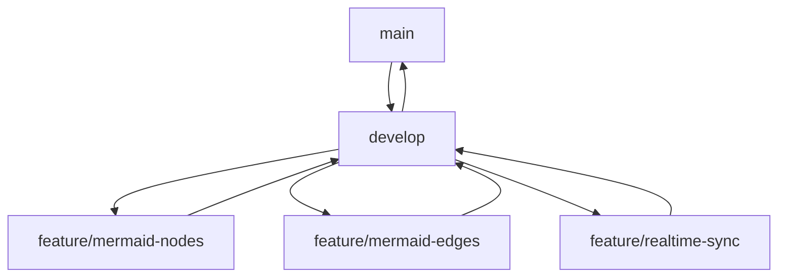

# Mermaid Chart Editor

A visual editor for creating and editing Mermaid diagrams with real-time collaboration.

## Features

- Visual diagram creation with drag-and-drop interface
- Support for multiple diagram types:
  - Flowcharts
  - Sequence diagrams
  - Class diagrams
  - State diagrams
  - Entity Relationship diagrams
  - Gantt charts
- Real-time collaboration
- Version history
- Export to Mermaid markdown, SVG, or PNG
- Project organization and sharing

## Getting Started

### Prerequisites

- [Bun](https://bun.sh) (for package management and development)
- [Node.js](https://nodejs.org) 18+ (optional, Bun is recommended)
- [Supabase](https://supabase.com) account for backend services

### Setup

1. Clone the repository:
```bash
git clone https://github.com/yourusername/mermaid-editor.git
cd mermaid-editor
```

2. Install dependencies:
```bash
bun install
```

3. Set up Supabase:
   - Create a new project at [Supabase](https://supabase.com)
   - Copy your project URL and anon key from the project settings
   - Copy `.env.example` to `.env` and update with your Supabase credentials:
     ```
     VITE_SUPABASE_URL=your-project-url
     VITE_SUPABASE_ANON_KEY=your-anon-key
     ```

4. Start the development server:
```bash
bun run dev
```

### Development

- `bun run dev` - Start development server
- `bun run build` - Build for production
- `bun run preview` - Preview production build
- `bun test` - Run tests
- `bun run lint` - Run linter

---

# Implementation Plan

## Current Foundation
The project starts with a React Flow template that includes:
- Vite + TypeScript setup
- Basic React Flow implementation with nodes and edges
- Custom node type (PositionLoggerNode)
- Basic controls, minimap, and background

## Phase 1: Core Mermaid Components
Duration: 1-2 weeks

### 1.1 Node Types
Create custom nodes for Mermaid diagram elements:
```typescript
export type MermaidNodeType =
  | 'flowchart-node'
  | 'sequence-participant'
  | 'class-node'
  | 'state-node'
  | 'er-entity'
  | 'gantt-task';

interface MermaidNodeData {
  label: string;
  type: MermaidNodeType;
  properties: Record<string, any>;
  mermaidSyntax: string;
}
```

Tasks:
1. Create base MermaidNode component
2. Implement node-specific renderers
3. Add node configuration panels
4. Implement drag-and-drop from component library

### 1.2 Edge Types
Create custom edges for Mermaid connections:
```typescript
export type MermaidEdgeType =
  | 'flowchart-link'
  | 'sequence-message'
  | 'class-relation'
  | 'state-transition'
  | 'er-relation';

interface MermaidEdgeData {
  label?: string;
  type: MermaidEdgeType;
  style?: 'solid' | 'dashed';
  arrow?: '-->' | '---' | '==>' | '...>';
  mermaidSyntax: string;
}
```

Tasks:
1. Implement edge types with Mermaid-specific styling
2. Add edge labels and customization
3. Create edge configuration panel

### 1.3 Mermaid Integration
```typescript
interface MermaidConverter {
  toMermaid(): string;
  fromMermaid(markdown: string): {
    nodes: MermaidNode[];
    edges: MermaidEdge[];
  };
}
```

Tasks:
1. Implement Mermaid syntax generation
2. Add live preview panel
3. Create parser for importing existing diagrams

## Phase 2: Supabase Integration
Duration: 1 week

### 2.1 Project Setup
```typescript
interface Project {
  id: string;
  name: string;
  description?: string;
  created_at: string;
  updated_at: string;
  owner_id: string;
}

interface Diagram {
  id: string;
  project_id: string;
  name: string;
  content: {
    nodes: MermaidNode[];
    edges: MermaidEdge[];
    viewport?: Viewport;
  };
  mermaid_markdown: string;
  version: number;
  updated_at: string;
}
```

Tasks:
1. Set up Supabase tables and relationships
2. Implement authentication
3. Create project management UI

### 2.2 Real-time Updates
```typescript
interface RealtimeUpdate {
  type: 'node_change' | 'edge_change' | 'connection';
  data: any;
  user: string;
  timestamp: number;
}
```

Tasks:
1. Implement real-time subscriptions
2. Add update throttling (500ms)
3. Handle conflict resolution
4. Add presence indicators

## Phase 3: Enhanced UI/UX
Duration: 1-2 weeks

### 3.1 Component Library
```typescript
interface ComponentTemplate {
  type: MermaidNodeType;
  label: string;
  properties: Record<string, any>;
  preview: string;
  category: string;
}
```

Tasks:
1. Create component library panel
2. Implement drag-and-drop from library
3. Add component categories and search
4. Create common templates

### 3.2 Workspace Layout
```typescript
interface WorkspaceLayout {
  leftPanel: {
    width: number;
    activeTab: 'components' | 'explorer';
  };
  rightPanel: {
    width: number;
    activeTab: 'properties' | 'preview';
  };
  bottomPanel?: {
    height: number;
    activeTab: 'markdown' | 'console';
  };
}
```

Tasks:
1. Implement resizable panels
2. Add panel collapse/expand
3. Create toolbar with common actions
4. Add keyboard shortcuts

## Phase 4: Export & Integration
Duration: 1 week

### 4.1 Export Options
Tasks:
1. Implement Mermaid markdown export
2. Add SVG/PNG export
3. Create shareable links
4. Add embed code generation

### 4.2 Version Control
```typescript
interface DiagramVersion {
  id: string;
  diagram_id: string;
  content: {
    nodes: MermaidNode[];
    edges: MermaidEdge[];
  };
  mermaid_markdown: string;
  created_at: string;
  author_id: string;
  message?: string;
}
```

Tasks:
1. Implement version history
2. Add diff viewer
3. Enable version restoration
4. Add branching support

## Technical Dependencies
```json
{
  "dependencies": {
    "@xyflow/react": "^12.3.6",
    "@supabase/supabase-js": "latest",
    "mermaid": "latest",
    "zustand": "latest",
    "@radix-ui/react-*": "latest",
    "tailwindcss": "latest",
    "html-to-image": "latest"
  }
}
```

## Build Tool Strategy

### Current Setup vs Alternatives

#### Vite (Current)
Pros:
- Already set up in the React Flow template
- Excellent HMR (Hot Module Replacement)
- Great TypeScript support
- Wide plugin ecosystem
- Strong community support

#### Bun
Pros:
- Significantly faster than Node.js
- Built-in bundler, test runner, and package manager
- Native TypeScript support
- Can run Vite projects

Cons:
- Newer ecosystem, some packages might not be fully compatible
- Some Vite plugins might not work properly

### Recommendation
1. Keep Vite as the primary build tool for development and production builds
2. Use Bun as the runtime and package manager:
   ```json
   {
     "scripts": {
       "dev": "bun run vite",
       "build": "bun run tsc && bun run vite build",
       "preview": "bun run vite preview",
       "test": "bun test"
     }
   }
   ```
This approach gives us:
- Vite's mature ecosystem and tooling
- Bun's superior performance for package management and script execution
- Ability to gradually migrate more functionality to Bun as the ecosystem matures

## Docker Strategy

### Development Environment
```dockerfile
# Development Dockerfile
FROM oven/bun:latest

WORKDIR /app

# Install dependencies
COPY package.json bun.lockb ./
RUN bun install

# Copy source code
COPY . .

# Start development server
CMD ["bun", "run", "dev"]
```

### Production Environment
```dockerfile
# Production Dockerfile
FROM oven/bun:latest AS builder

WORKDIR /app

# Install dependencies
COPY package.json bun.lockb ./
RUN bun install

# Copy source code and build
COPY . .
RUN bun run build

# Production runtime
FROM nginx:alpine

# Copy built assets
COPY --from=builder /app/dist /usr/share/nginx/html

# Copy nginx configuration
COPY nginx.conf /etc/nginx/conf.d/default.conf

EXPOSE 80

CMD ["nginx", "-g", "daemon off;"]
```

### Nginx Configuration
```nginx
# nginx.conf
server {
    listen 80;
    server_name localhost;
    root /usr/share/nginx/html;
    index index.html;

    # Support for SPA routing
    location / {
        try_files $uri $uri/ /index.html;
    }

    # Cache static assets
    location /assets/ {
        expires 1y;
        add_header Cache-Control "public, no-transform";
    }
}
```

### Docker Compose Setup
```yaml
# docker-compose.yml
version: '3.8'

services:
  # Development environment
  app-dev:
    build:
      context: .
      dockerfile: Dockerfile.dev
    ports:
      - "5173:5173"
    volumes:
      - .:/app
      - /app/node_modules
    environment:
      - VITE_SUPABASE_URL=${SUPABASE_URL}
      - VITE_SUPABASE_ANON_KEY=${SUPABASE_ANON_KEY}

  # Production environment
  app-prod:
    build:
      context: .
      dockerfile: Dockerfile
    ports:
      - "80:80"
    environment:
      - VITE_SUPABASE_URL=${SUPABASE_URL}
      - VITE_SUPABASE_ANON_KEY=${SUPABASE_ANON_KEY}

  # Local Supabase (optional)
  supabase:
    image: supabase/supabase-local
    ports:
      - "54322:5432"  # PostgreSQL
      - "54323:8000"  # Kong
      - "54324:5555"  # Studio
    environment:
      POSTGRES_PASSWORD: your-super-secret-password
```

### Development Workflow
1. Local Development:
   ```bash
   # Start development environment
   docker-compose up app-dev

   # Or with local Supabase
   docker-compose up app-dev supabase
   ```

2. Production Build:
   ```bash
   # Build and start production container
   docker-compose up app-prod
   ```

### CI/CD Pipeline
```yaml
name: CI/CD

on:
  push:
    branches: [ main ]
  pull_request:
    branches: [ main ]

jobs:
  build:
    runs-on: ubuntu-latest
    steps:
      - uses: actions/checkout@v2
      
      - name: Setup Bun
        uses: oven-sh/setup-bun@v1
        
      - name: Install dependencies
        run: bun install
        
      - name: Build
        run: bun run build
        
      - name: Test
        run: bun test
        
      - name: Build Docker image
        run: docker build -t mermaid-editor .
        
      - name: Push to registry
        if: github.ref == 'refs/heads/main'
        run: |
          docker tag mermaid-editor registry.example.com/mermaid-editor
          docker push registry.example.com/mermaid-editor
```

### Deployment Considerations
1. Environment Variables:
   - Use `.env` for local development
   - Use secrets management in production
   - Configure CI/CD pipeline with appropriate secrets

2. Volume Management:
   - Development: Mount source code for hot reloading
   - Production: Use Docker volumes for persistent data

3. Scaling:
   - Use container orchestration (e.g., Kubernetes)
   - Implement health checks
   - Set up monitoring and logging

4. Security:
   - Regular security updates for base images
   - Scan containers for vulnerabilities
   - Implement proper access controls

## Development Guidelines

### State Management
```typescript
interface Store {
  diagram: {
    nodes: MermaidNode[];
    edges: MermaidEdge[];
    selected: Set<string>;
  };
  ui: WorkspaceLayout;
  collaboration: {
    users: Map<string, UserPresence>;
    pending: RealtimeUpdate[];
  };
}
```

### Code Organization
```
src/
  components/
    nodes/
    edges/
    panels/
    toolbar/
  features/
    mermaid/
    collaboration/
    export/
  store/
  supabase/
  utils/
```

### Testing Strategy
1. Unit tests for:
   - Mermaid conversion
   - State management
   - Component rendering
2. Integration tests for:
   - Node/edge interactions
   - Real-time updates
   - Export functionality
3. E2E tests for critical user flows

## Deployment Strategy
1. Development:
   - Local Vite dev server
   - Local Supabase instance
2. Staging:
   - Vercel preview deployments
   - Staging Supabase project
3. Production:
   - Vercel production deployment
   - Production Supabase project with backups

## Success Criteria
1. Smooth, intuitive diagram creation
2. Real-time updates with <100ms latency
3. Correct Mermaid syntax generation
4. Responsive UI with no performance issues
5. Successful import of existing diagrams
6. Reliable export functionality

## Git Strategy

### Commit Structure
Each feature implementation should follow this commit pattern:

1. Initial Setup Commits:
```
feat: Initialize project with Vite and Bun
- Add Vite configuration
- Set up Bun as package manager
- Configure TypeScript

feat: Add base React Flow implementation
- Set up React Flow components
- Add basic node types
- Configure flow container
```

2. Core Feature Commits:
```
feat: Implement Mermaid node types
- Add base MermaidNode component
- Create node type definitions
- Set up node rendering logic

feat: Add Mermaid edge components
- Implement edge types
- Add edge styling
- Create edge configuration

feat: Set up Mermaid syntax conversion
- Add Mermaid.js integration
- Implement markdown generation
- Create preview functionality
```

3. Supabase Integration Commits:
```
feat: Initialize Supabase client
- Add authentication setup
- Configure database tables
- Set up real-time subscriptions

feat: Implement real-time collaboration
- Add presence indicators
- Set up change synchronization
- Implement conflict resolution
```

### Branch Strategy


1. Main Branches:
   - `main`: Production-ready code
   - `develop`: Integration branch for features

2. Feature Branches:
   - `feature/mermaid-nodes`: Node implementation
   - `feature/mermaid-edges`: Edge implementation
   - `feature/realtime-sync`: Supabase integration

3. Release Process:
   - Feature branches merge into `develop`
   - `develop` merges to `main` for releases
   - Tag releases with semantic versioning

### Commit Guidelines
1. Format: `<type>(<scope>): <description>`
   - Types: feat, fix, docs, style, refactor, test, chore
   - Scope: nodes, edges, sync, ui, etc.
   - Description: Present tense, concise

2. Examples:
   ```
   feat(nodes): Add flowchart node type
   fix(edges): Correct edge connection handling
   refactor(sync): Optimize real-time updates
   test(converter): Add Mermaid syntax tests
   ```

3. Pull Request Template:
   ```markdown
   ## Changes
   - Detailed list of changes
   - Impact on existing features
   - New functionality added

   ## Testing
   - Test cases covered
   - Manual testing steps
   - Performance considerations

   ## Screenshots
   - Before/After UI changes
   - New feature demonstrations
   ```

## Next Steps
1. Set up project with Vite and dependencies
2. Create Supabase project and configure tables
3. Implement basic node types and Mermaid conversion
4. Begin real-time collaboration features